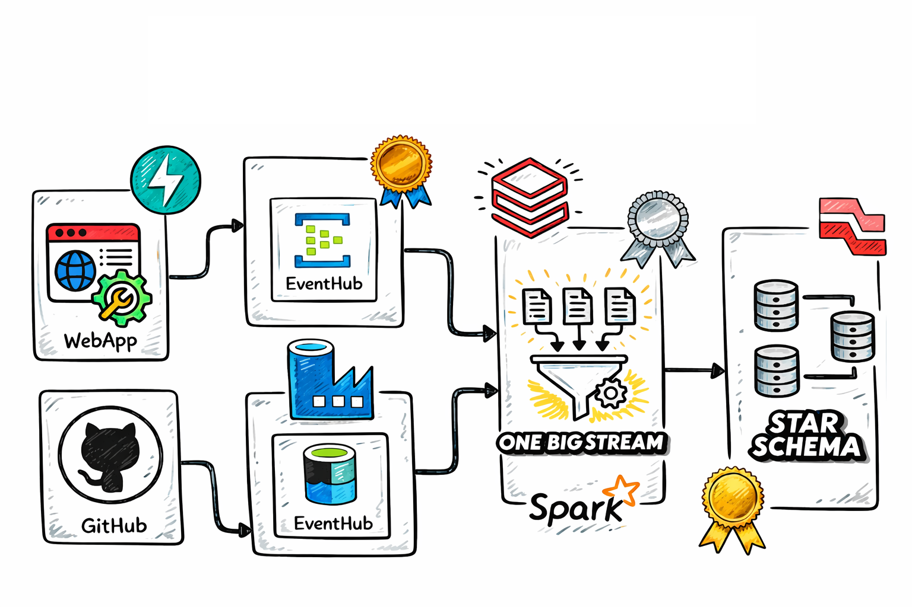
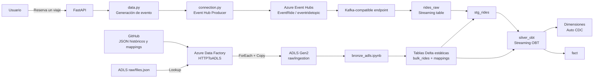
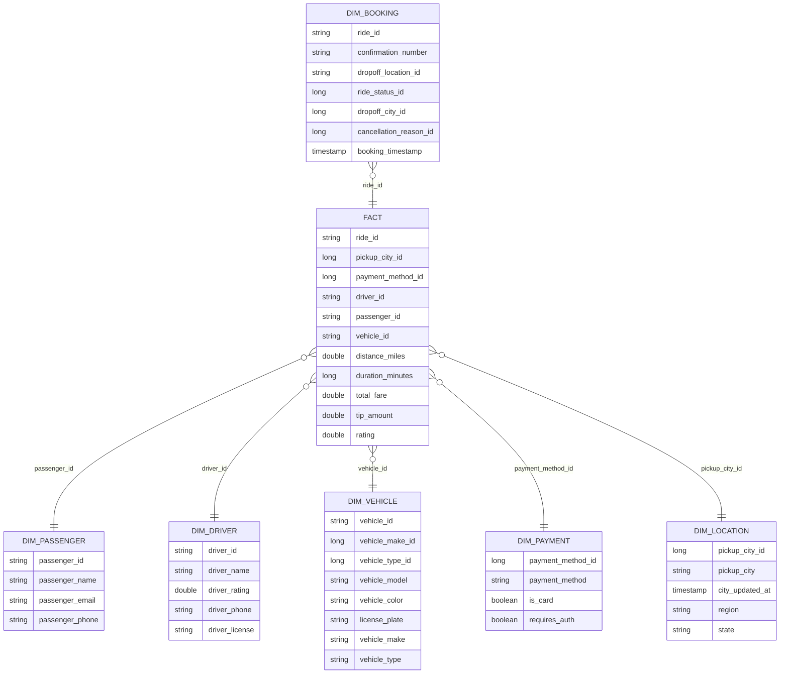

<div align="center">

# EventRide

### Pipeline de Data Engineering batch y streaming sobre Azure y Databricks

[](https://www.python.org/)
[](https://fastapi.tiangolo.com/)
[](https://azure.microsoft.com/products/event-hubs/)
[](https://azure.microsoft.com/products/data-factory/)
[](https://www.databricks.com/)
[](https://spark.apache.org/)

</div>

<p align="center">
  
</p>

## Descripción

**EventRide** es un proyecto end-to-end de Data Engineering que simula la plataforma de reservas de una empresa de transporte. La solución combina eventos generados en tiempo real con una carga histórica y varios catálogos de referencia para construir un modelo analítico mediante Azure y Databricks.

El flujo comienza en una aplicación web desarrollada con FastAPI. Cada reserva genera un evento JSON que se publica en **Azure Event Hubs**. Paralelamente, **Azure Data Factory** copia desde GitHub la carga histórica y los ficheros de mapping hacia **Azure Data Lake Storage Gen2**. En Databricks, **Lakeflow Spark Declarative Pipelines**, PySpark, SQL y Structured Streaming procesan ambas fuentes para crear una tabla OBT y un modelo dimensional con SCD Type 1 y Type 2.

Este proyecto permite practicar:

- Arquitecturas event-driven y el patrón productor-consumidor.
- Azure Event Hubs mediante su endpoint compatible con Kafka.
- Ingesta batch metadata-driven con Azure Data Factory.
- Azure Data Lake Storage Gen2 como zona raw.
- Spark Structured Streaming y Delta Lake en Databricks.
- Lakeflow Spark Declarative Pipelines.
- Unión de carga histórica y eventos incrementales.
- Generación de SQL metadata-driven mediante Jinja.
- Modelado dimensional con tablas de hechos y dimensiones.
- Slowly Changing Dimensions mediante Auto CDC.

---

## Arquitectura



### Flujo completo

1. El usuario pulsa **Reservar viaje** en la aplicación FastAPI.
2. `data.py` genera un evento ficticio con datos del pasajero, conductor, vehículo, ubicaciones, tiempos y tarifas.
3. `connection.py` serializa el evento y lo envía a Azure Event Hubs.
4. La tabla declarativa `rides_raw` consume Event Hubs mediante el conector Kafka de Spark.
5. Azure Data Factory lee `files.json`, recorre sus elementos con un `ForEach` y copia los JSON desde GitHub a `raw/ingestion` en ADLS Gen2.
6. `bronze_adls.ipynb` carga esos JSON y crea las tablas Delta de carga histórica y mappings.
7. Dos `append_flow` alimentan `stg_rides`:
   - `rides_bulk`: carga inicial desde `bulk_rides`.
   - `rides_stream`: eventos parseados desde `rides_raw`.
8. `silver_obt.sql` enriquece los viajes con los mappings y aplica un watermark de tres minutos.
9. `model.py` crea cinco dimensiones SCD Type 1, una dimensión SCD Type 2 y la tabla de hechos.


---

## Stack tecnológico

| Área | Tecnología | Función en el proyecto |
|---|---|---|
| Aplicación | FastAPI + Jinja2 | Interfaz web para generar reservas |
| Generación de datos | Python + Faker | Creación de eventos de viajes ficticios |
| Mensajería | Azure Event Hubs | Recepción y retención de eventos |
| Protocolo | Kafka  / Event Hubs| Consumo de Event Hubs desde Spark |
| Orquestación batch | Azure Data Factory | Copia metadata-driven de GitHub a ADLS |
| Data Lake | Azure Data Lake Storage Gen2 | Almacenamiento de JSON raw |
| Procesamiento | Databricks + PySpark | Transformación batch y streaming |
| Streaming | Spark Structured Streaming | Procesamiento incremental de eventos |
| Pipelines | Lakeflow Spark Declarative Pipelines | Gestión declarativa del DAG y las tablas |
| Almacenamiento | Delta Lake | Persistencia de tablas analíticas |
| Templating | Jinja2 | Generación dinámica de joins SQL |
| Modelado | Star Schema | Tabla de hechos y dimensiones |
| CDC | Auto CDC | Implementación de SCD Type 1 y Type 2 |

---

## Datos del proyecto

El repositorio incluye una carga histórica y seis ficheros de referencia:

| Fichero | Registros | Descripción |
|---|---:|---|
| `bulk_rides.json` | 2.000 | Carga histórica inicial de viajes |
| `map_cities.json` | 10 | Ciudades, comunidades, regiones y fecha de actualización |
| `map_cancellation_reasons.json` | 4 | Motivos de cancelación |
| `map_payment_methods.json` | 4 | Métodos de pago y atributos de autenticación |
| `map_ride_statuses.json` | 2 | Estados del viaje |
| `map_vehicle_makes.json` | 7 | Marcas de vehículos |
| `map_vehicle_types.json` | 5 | Tipos de vehículo y tarifas |

Cada viaje contiene 44 campos agrupados en:

- Identificadores de viaje, pasajero, conductor, vehículo y localizaciones.
- Claves foráneas hacia los mappings.
- Información del pasajero y del conductor.
- Datos del vehículo.
- Direcciones y coordenadas de origen y destino.
- Distancia, duración y timestamps.
- Tarifas, multiplicador de demanda, propina, total y valoración.

---

## Estructura real del repositorio

```text
EventRide/
├── api.py
├── connection.py
├── data.py
├── requirements.txt
├── .env.example
├── event.example.json
├── files.json
├── publish_config.json
│
├── templates/
│   ├── home.html
│   └── confirmation.html
│
├── data/
│   ├── bulk_rides.json
│   ├── map_cancellation_reasons.json
│   ├── map_cities.json
│   ├── map_payment_methods.json
│   ├── map_ride_statuses.json
│   ├── map_vehicle_makes.json
│   └── map_vehicle_types.json
│
├── azure/
│   ├── adf-eventride/
│   │   ├── ARMTemplateForFactory.json
│   │   ├── ARMTemplateParametersForFactory.json
│   │   ├── globalParameters/
│   │   └── linkedTemplates/
│   ├── dataset/
│   │   ├── ds_files.json
│   │   ├── ds_github.json
│   │   └── ds_ingest.json
│   ├── factory/
│   │   └── adf-eventride.json
│   ├── linkedService/
│   │   ├── ls_datalake.json
│   │   └── ls_github.json
│   └── pipeline/
│       └── HTTPToADLS.json
│
└── databricks/
    ├── bronze_adls.ipynb
    ├── silver.ipynb
    └── EventRide_Ingestion/
        └── transformations/
            ├── ingest.py
            ├── silver.py
            ├── silver_obt.sql
            └── model.py
```

### Archivos principales

| Archivo | Responsabilidad |
|---|---|
| `data.py` | Genera eventos ficticios de viajes |
| `connection.py` | Publica eventos en Azure Event Hubs |
| `api.py` | Expone la aplicación web FastAPI |
| `files.json` | Configura los ficheros que ADF debe copiar |
| `HTTPToADLS.json` | Pipeline metadata-driven de Azure Data Factory |
| `bronze_adls.ipynb` | Convierte los JSON de ADLS en tablas Delta |
| `ingest.py` | Consume Event Hubs y crea `rides_raw` |
| `silver.py` | Une la carga histórica y el stream en `stg_rides` |
| `silver_obt.sql` | Enriquece y crea la OBT streaming |
| `model.py` | Construye las dimensiones y la tabla de hechos |
| `silver.ipynb` | Notebook de exploración y generación de la consulta Jinja |

---

## Capas y tablas

### Bronze: fuentes raw y de referencia

| Tabla | Tipo | Origen |
|---|---|---|
| `rides_raw` | Streaming table | Azure Event Hubs |
| `bulk_rides` | Delta table | Carga histórica en ADLS |
| `map_cities` | Delta table | ADLS |
| `map_cancellation_reasons` | Delta table | ADLS |
| `map_payment_methods` | Delta table | ADLS |
| `map_ride_statuses` | Delta table | ADLS |
| `map_vehicle_makes` | Delta table | ADLS |
| `map_vehicle_types` | Delta table | ADLS |

`rides_raw` conserva las columnas nativas del conector Kafka y añade `rides`, que contiene el JSON del evento convertido a string.

### Silver: staging y OBT

#### `stg_rides`

Streaming table alimentada por dos flujos:

```text
bulk_rides ── rides_bulk ──┐
                           ├──> stg_rides
rides_raw ── rides_stream ─┘
```

- `rides_bulk` incorpora la carga inicial.
- `rides_stream` parsea el JSON utilizando un `StructType` de 44 campos.
- `booking_timestamp` se convierte a `TimestampType` en la carga histórica.

#### `silver_obt`

One Big Table enriquecida mediante `LEFT JOIN` con:

- Marcas de vehículo.
- Tipos de vehículo y sus tarifas.
- Estados del viaje.
- Métodos de pago.
- Ciudades de recogida.
- Motivos de cancelación.

La tabla se crea como streaming table y utiliza:

```sql
WATERMARK booking_timestamp DELAY OF INTERVAL 3 MINUTES
```

El notebook `silver.ipynb` contiene la configuración Jinja que genera estos `SELECT` y `JOIN`. El SQL renderizado se guarda en `silver_obt.sql` para que el pipeline lo ejecute declarativamente.

### Gold: modelo dimensional



| Objeto | Clave | Estrategia actual |
|---|---|---|
| `dim_passenger` | `passenger_id` | Auto CDC, SCD Type 1 |
| `dim_driver` | `driver_id` | Auto CDC, SCD Type 1 |
| `dim_vehicle` | `vehicle_id` | Auto CDC, SCD Type 1 |
| `dim_payment` | `payment_method_id` | Auto CDC, SCD Type 1 |
| `dim_booking` | `ride_id` | Auto CDC, SCD Type 1 |
| `dim_location` | `pickup_city_id` | Auto CDC, SCD Type 2 |
| `fact` | Clave compuesta | Auto CDC, SCD Type 1 |

`dim_location` utiliza `city_updated_at` como columna de secuenciación. Databricks añade las columnas de vigencia necesarias para conservar el historial de cambios.

---

## Requisitos

### Local

- Git.
- Python 3.13 recomendado, ya que el entorno incluido en el proyecto fue creado con Python 3.13.3.
- Cuenta y suscripción de Azure.

### Azure

- Azure Event Hubs, tier Standard o superior para utilizar el endpoint Kafka.
- Un namespace de Event Hubs.
- Un Event Hub.
- Azure Data Lake Storage Gen2.
- Azure Data Factory.
- Workspace de Azure Databricks con Unity Catalog.

### Recursos utilizados por defecto

La implementación actual contiene estos nombres:

| Recurso | Nombre en el código |
|---|---|
| Event Hubs namespace | `EventRide` |
| Event Hub | `eventridetopic` |
| Data Factory | `adf-eventride` |
| Storage account | `dleventride` |
| Catalog de Databricks | `eventride` |
| Schema principal | `bronze` |

Puedes utilizar otros nombres, pero deberás actualizar las referencias correspondientes.

---

## Ejecución local

### 1. Clonar el repositorio

```bash
git clone https://github.com/danielrob1/EventRide.git
cd EventRide
```

### 2. Crear y activar un entorno virtual

#### Windows PowerShell

```powershell
python -m venv .venv
.venv\Scripts\Activate.ps1
```

#### Linux o macOS

```bash
python3 -m venv .venv
source .venv/bin/activate
```

### 3. Instalar las dependencias

```bash
python -m pip install --upgrade pip
pip install -r requirements.txt
```

### 4. Configurar las variables de entorno

Copia el fichero de ejemplo:

```bash
cp .env.example .env
```

En Windows PowerShell:

```powershell
Copy-Item .env.example .env
```

Completa `.env` con los nombres exactos que utiliza `connection.py`:

```env
CONNECTION_STRING="Endpoint=sb://..."
EVENT_HUBNAME="eventridetopic"
```

La connection string debe pertenecer a una Shared Access Policy con permiso **Send**.

### 5. Enviar un evento desde terminal

```bash
python connection.py
```

El script muestra el evento generado y lo publica en Event Hubs.

### 6. Ejecutar la aplicación web

```bash
uvicorn api:app --reload
```

También se puede ejecutar:

```bash
python api.py
```

Abre:

```text
http://localhost:8000
```

Cada acceso a `/book` genera y envía un nuevo evento.

---

## Configuración de Azure Event Hubs

1. Crea un namespace con tier **Standard** o superior.
2. Crea un Event Hub, por defecto `eventridetopic`.
3. Crea dos Shared Access Policies:
   - `Send`: utilizada por la aplicación FastAPI.
   - `Listen`: utilizada por Databricks.
4. Coloca la connection string de `Send` en el `.env` local.
5. Añade la connection string de `Listen` como configuración segura del pipeline de Databricks.

La configuración de streaming se encuentra en:

```text
databricks/EventRide_Ingestion/transformations/ingest.py
```

El pipeline espera una propiedad de Spark llamada:

```text
connection_string
```

Y la recupera mediante:

```python
EH_CONN_STR = spark.conf.get("connection_string")
```

Si cambias el namespace o el Event Hub, actualiza también:

```python
EH_NAMESPACE = "EventRide"
EH_NAME = "eventridetopic"
```

---

## Despliegue de Azure Data Factory

El repositorio contiene dos formas de reconstruir ADF:

- Artefactos individuales en `azure/dataset`, `azure/linkedService` y `azure/pipeline`.
- Plantillas ARM en `azure/adf-eventride`.

### Objetos incluidos

| Tipo | Nombre |
|---|---|
| Pipeline | `HTTPToADLS` |
| Linked service HTTP | `ls_github` |
| Linked service ADLS | `ls_datalake` |
| Dataset de configuración | `ds_files` |
| Dataset HTTP parametrizado | `ds_github` |
| Dataset de destino | `ds_ingest` |

### Funcionamiento de `HTTPToADLS`

```text
Lookup files
    ↓
ForEachFile
    ↓
HTTP_Ingestion
    ↓
raw/ingestion/<file>.json
```

- `Lookup files` lee `raw/files.json` desde ADLS.
- `ForEachFile` itera sobre `@activity('files').output.value`.
- `HTTP_Ingestion` lee desde `raw.githubusercontent.com`.
- Los JSON se escriben en el contenedor `raw`, carpeta `ingestion`.


### Desplegar mediante ARM

Desde Azure Portal:

1. Abre **Deploy a custom template**.
2. Usa `azure/adf-eventride/ARMTemplateForFactory.json`.
3. Completa los parámetros de `ARMTemplateParametersForFactory.json`.
4. Proporciona una credencial válida para el Data Lake.
5. Verifica las URLs del storage account y del repositorio.

---

## Configuración de Databricks

### 1. Crear catálogo y schema

```sql
CREATE CATALOG IF NOT EXISTS eventride;
CREATE SCHEMA IF NOT EXISTS eventride.bronze;
```

### 2. Cargar las tablas estáticas

Importa y ejecuta:

```text
databricks/bronze_adls.ipynb
```

El notebook crea estas tablas:

```text
eventride.bronze.bulk_rides
eventride.bronze.map_cities
eventride.bronze.map_cancellation_reasons
eventride.bronze.map_payment_methods
eventride.bronze.map_ride_statuses
eventride.bronze.map_vehicle_makes
eventride.bronze.map_vehicle_types
```


### 3. Crear el pipeline declarativo

Crea un Lakeflow Spark Declarative Pipeline con:

| Propiedad | Valor recomendado |
|---|---|
| Source code | `databricks/EventRide_Ingestion/transformations` |
| Catalog | `eventride` |
| Target schema | `bronze` |
| Pipeline configuration | `connection_string=<Event Hubs Listen connection string>` |

El directorio contiene código Python y SQL, por lo que deben añadirse los cuatro ficheros como fuentes del mismo pipeline:

```text
ingest.py
silver.py
silver_obt.sql
model.py
```

### 4. Orden lógico resuelto por el pipeline

```text
rides_raw
    │
    ├─────────────┐
    │             │
bulk_rides     rides_stream
    │             │
    └──> stg_rides
             │
             └──> silver_obt
                       │
                       ├──> dim_passenger
                       ├──> dim_driver
                       ├──> dim_vehicle
                       ├──> dim_payment
                       ├──> dim_booking
                       ├──> dim_location
                       └──> fact
```

Lakeflow detecta las dependencias entre tablas y ejecuta el DAG en el orden correspondiente.

---

## Pipeline metadata-driven con Jinja

El notebook `databricks/silver.ipynb` define una lista `jinja_config`. Cada elemento especifica:

- Tabla y alias.
- Columnas que deben seleccionarse.
- Condición de unión.
- Condición `WHERE`, cuando exista.

Ejemplo simplificado:

```python
jinja_config = [
    {
        "table": "eventride.bronze.stg_rides stg_rides",
        "select": "stg_rides.*",
        "where": ""
    },
    {
        "table": "eventride.bronze.map_vehicle_types map_vehicle_types",
        "select": "map_vehicle_types.vehicle_type, map_vehicle_types.base_rate",
        "where": "",
        "on": "stg_rides.vehicle_type_id = map_vehicle_types.vehicle_type_id"
    }
]
```

La plantilla recorre la configuración y genera el `SELECT` y los `LEFT JOIN`. Esto permite incorporar un nuevo mapping modificando principalmente la configuración, en lugar de reescribir toda la consulta.

El resultado renderizado se encuentra en:

```text
databricks/EventRide_Ingestion/transformations/silver_obt.sql
```

---

## Validación

### Comprobar la ingesta batch

```sql
SELECT COUNT(*) FROM eventride.bronze.bulk_rides;
-- Resultado esperado con los datos del repositorio: 2000
```

### Comprobar el stream raw

```sql
SELECT
  topic,
  partition,
  offset,
  timestamp,
  rides
FROM eventride.bronze.rides_raw
ORDER BY timestamp DESC;
```

### Comprobar la unión batch + streaming

```sql
SELECT COUNT(*)
FROM eventride.bronze.stg_rides;
```

El total debe ser igual a los 2.000 viajes históricos más los eventos nuevos procesados, sin volver a insertar la carga ya consumida en cada actualización del pipeline.

### Comprobar la OBT

```sql
SELECT *
FROM eventride.bronze.silver_obt
LIMIT 20;
```

### Comprobar las dimensiones y hechos

```sql
SELECT * FROM eventride.bronze.dim_passenger LIMIT 10;
SELECT * FROM eventride.bronze.dim_location ORDER BY pickup_city_id;
SELECT * FROM eventride.bronze.fact LIMIT 10;
```

Para `dim_location`, comprueba que las versiones históricas contienen las columnas de inicio y fin de vigencia generadas por Auto CDC.


